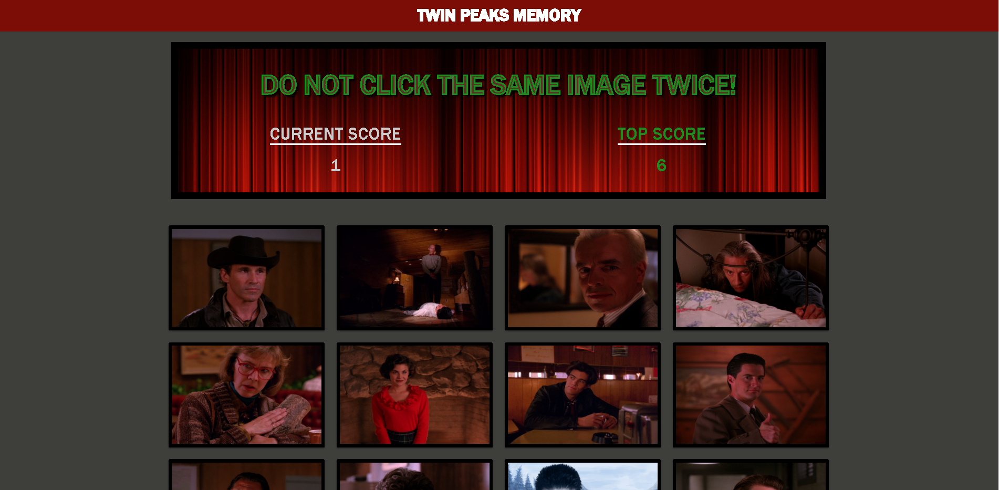

# Twin Peaks React memory style click game

## [Live Link](https://humanjboof.github.io/react-click-game/)

## Description 

This app was built using create-react-app, it is a memory style game. There are 12 images, the user starts by clicking on an image, once clicked the images will shuffle, keeping track of how many times you have clicked __BUT__ watch out! If you click the same image twice, *YOU LOSE!*. 

## Technologies used
- Node.js
- Javascript
- Materialize
- React 
- React-Dom
- React-Scripts
- gh-pages

**prerequisites**
- Install node.js, npm/yarn

## Instructions for local use

- Git-Clone the repo to a spot on your desktop
- cd to the repo
- run yarn install
- yarn start
- after this the app will open up in your default browser!

# Author
## *Joshua LeBoeuf*
